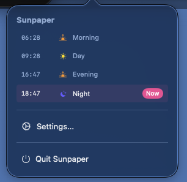
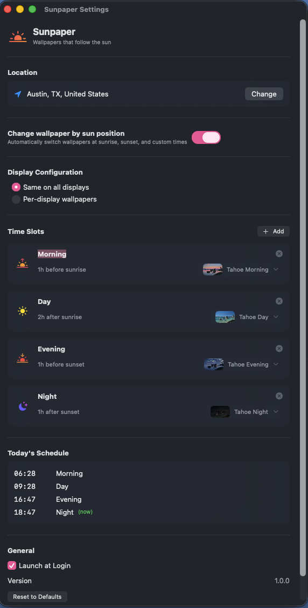

# Sunpaper

Automatically change video wallpapers on macOS.

Apple's aerial wallpaper collections (Tahoe, Sequoia) include time-of-day variants - morning, day, evening, and night versions of the same location. Sunpaper switches between them based on the actual sun position at your location.

### Why isn't this on the App Store?

macOS doesn't provide a public API for changing video wallpapers. Sunpaper works by updating the system's wallpaper configuration file directly, which requires file system access that App Store sandboxing doesn't allow.

## Download

**[Download Sunpaper 1.0](https://github.com/mduncs/sunpaper/releases/latest)**

Click the link above, then click **Sunpaper-1.0.zip** to download. Unzip it and drag Sunpaper.app to your Applications folder.

## Screenshots

<p align="center">
  
  
</p>

## Getting Started

1. **Download Apple's aerial wallpapers first**: System Settings > Wallpaper > choose Tahoe or Sequoia and let it download
2. Download Sunpaper and move it to your Applications folder
3. Launch Sunpaper - it appears as a sun icon in your menu bar
4. Grant location permission when prompted
5. Done - your wallpaper now follows the sun

The app references wallpapers already on your Mac. If you haven't downloaded an aerial collection from System Settings, there's nothing to switch between.

## Features

- **Solar-aware scheduling** - transitions happen at actual sunrise and sunset for your location
- **Flexible time slots** - add, remove, or customize transition times
- **Multiple collections** - Tahoe and Sequoia built-in
- **Multi-monitor support** - same wallpaper on all displays, or configure each separately
- **Launch at login** - runs quietly in the background

## Requirements

- macOS 14.0 (Sonoma) or later - macOS 15.0 (Sequoia) recommended
- Aerial wallpapers must be downloaded first: System Settings > Wallpaper > select an aerial collection

## Permissions

When you first run Sunpaper, macOS may warn that it's from an unidentified developer. Right-click the app and choose "Open" to bypass this.

The app needs:
- **Location** - to calculate sunrise/sunset times for your area
- **File access** - to update the system wallpaper configuration

## Known Issues

- **Brief gray flash during transitions** - you may see a gray screen for less than a second while the new video loads. This is a limitation of how macOS refreshes video wallpapers.

## Building from Source

```
git clone https://github.com/mduncs/sunpaper.git
cd sunpaper
xcodebuild -scheme Sunpaper -configuration Release
```

The built app will be in `build/Build/Products/Release/Sunpaper.app`

## Credits

Built with Claude (Anthropic).

## License

MIT
