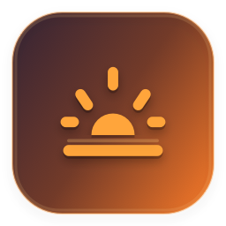
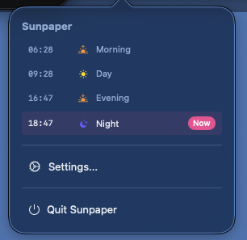
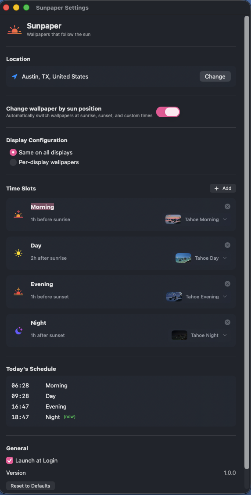

<p align="center">
  
</p>

# Sunpaper

Sunpaper is a macOS menu bar utility that automatically changes video wallpapers.

Apple's aerial wallpaper collections (Tahoe, Sequoia) include time-of-day variants - morning, day, evening, and night versions of the same location. Sunpaper switches between them based on the actual sun position at your location.

### Why isn't this on the App Store?

macOS does not provide a public API for changing Apple aerial video wallpapers. Sunpaper works by updating macOS wallpaper state directly, including the private `Index.plist` behavior documented in [WALLPAPER_INTERNALS.md](WALLPAPER_INTERNALS.md). That integration is not an Apple-supported API and is not currently positioned as an App Store sandboxed app.

## Download

**[Download the latest Sunpaper release](https://github.com/mduncs/sunpaper/releases/latest)**

Click the link above, download the release zip, unzip it, and drag Sunpaper.app to your Applications folder.

## Screenshots

<p align="center">
  
  
</p>

## Getting Started

1. **Download Apple's aerial wallpapers first**: System Settings > Wallpaper > choose Tahoe or Sequoia and let it download
2. Download Sunpaper and move it to your Applications folder
3. Launch Sunpaper - it appears as a sun icon in your menu bar
4. Grant location permission when prompted, or set a manual location in Settings
5. Done - your wallpaper now follows the sun

The app uses Apple's local aerial catalog and local wallpaper assets. If the catalog is missing, there may be nothing to show. If an individual aerial asset is missing, Sunpaper can only download it when Apple's local catalog provides a download URL.

## Features

- **Solar-aware scheduling** - transitions happen at actual sunrise and sunset for your location
- **Flexible time slots** - add, remove, or customize transition times
- **Multiple collections** - Tahoe and Sequoia built-in
- **Multi-monitor support** - same wallpaper on all displays, or configure each separately
- **Launch at login** - uses macOS `SMAppService.mainApp` to register the menu bar utility

## Requirements

- macOS 14.0 (Sonoma) or later - macOS 15.0 (Sequoia) recommended
- Apple's aerial wallpaper catalog must be available locally. The usual way to create it is System Settings > Wallpaper > select an aerial collection.

## Trust and Permissions

Sunpaper is distributed directly, not through the App Store. Depending on how a release was built and distributed, macOS may show unidentified developer, notarization, or first-open security prompts. Only run builds from a source you trust.

The app needs:
- **Location** - to calculate sunrise, sunset, and related sun-position schedule times. If location access is denied, use the manual location fallback in Settings.
- **Wallpaper configuration access** - to update macOS wallpaper state for Apple aerials. This relies on private system plist behavior and may need adjustment when macOS changes.
- **Launch at login approval** - optional, if you enable launch at login. Sunpaper registers the main app using `SMAppService.mainApp`.

## Known Issues

- **Brief gray flash during transitions** - you may see a gray screen for less than a second while the new video loads. This is a limitation of how macOS refreshes video wallpapers.
- **Private wallpaper internals** - Apple does not document or guarantee the `Index.plist` integration Sunpaper uses for aerial wallpapers. macOS updates can change this behavior.

## Building from Source

```
git clone https://github.com/mduncs/sunpaper.git
cd sunpaper
xcodebuild -scheme Sunpaper -configuration Release
```

The built app will be in `build/Build/Products/Release/Sunpaper.app`

## Credits

Built with Claude (Anthropic).

## License

MIT
