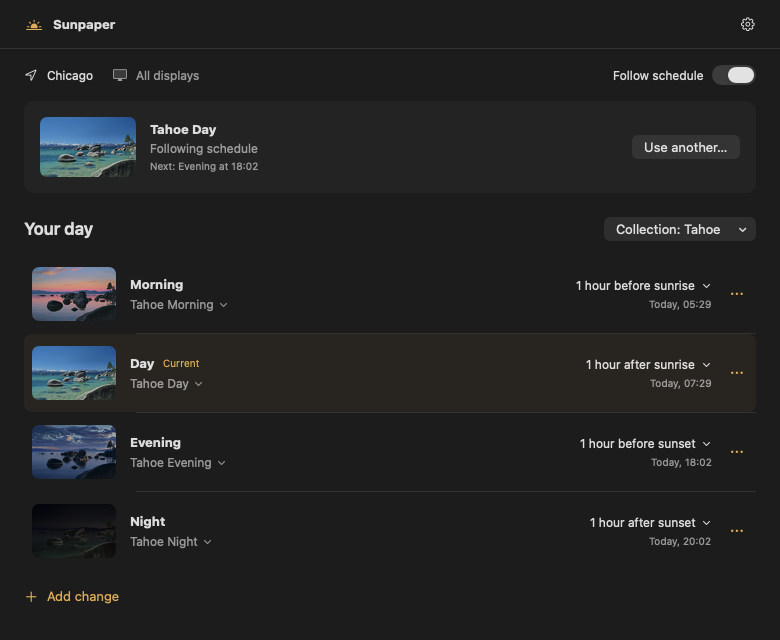
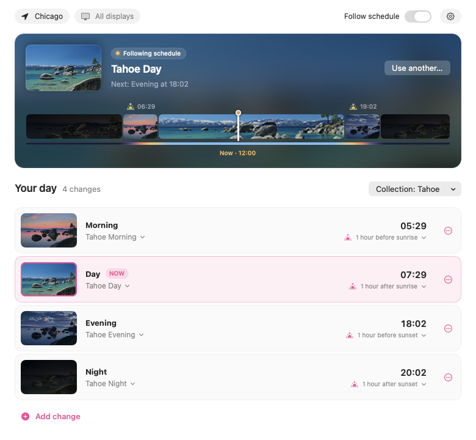
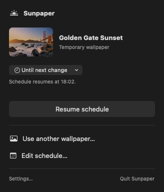
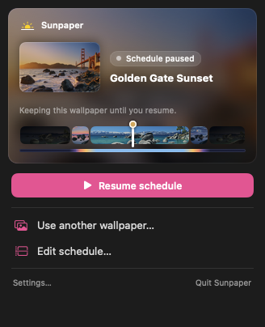
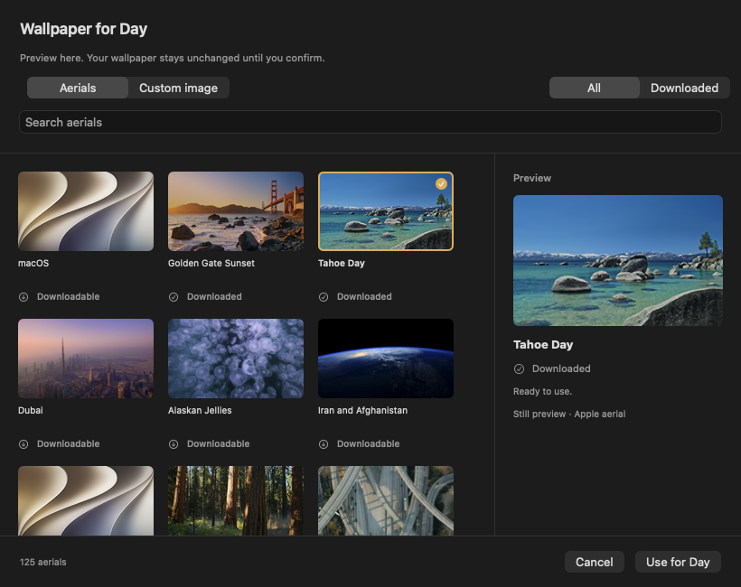
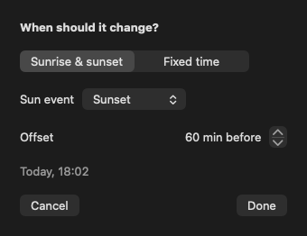
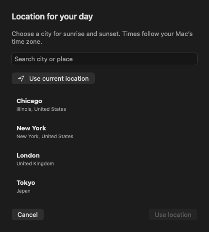

<p align="center">
  
</p>

# Sunpaper

Sunpaper is a native macOS menu bar app that changes Apple aerial wallpapers
throughout your day. Build a schedule around sunrise and sunset, use fixed
times, or choose a wallpaper temporarily. Custom still images work too.

## Download

Get the packaged app from **[GitHub Releases](https://github.com/mduncs/sunpaper/releases/latest)**,
open the disk image, and drag Sunpaper to Applications.

The screenshots and features below describe the **current development source**.
The published **v1.1.0** release uses the previous interface.

## Your day

Open **Edit schedule…** from the menu bar to arrange your day. Each row has
separate wallpaper and timing choices. Start with a Tahoe or Sequoia collection,
or add your own changes. Row menus let you rename, disable, duplicate, download
again, or remove a change. Schedule edits support undo and redo.



The menu shows the last successfully applied wallpaper and the next change.
**Pause schedule** keeps the wallpaper and leaves your schedule editable.
**Use another wallpaper…** lets you browse without changing the desktop;
only confirming a choice applies it.

A manual choice while following lasts **until the next change**, **for one
hour**, or **until tomorrow** (local midnight). Choose **Resume schedule** to
return sooner. Manual choices while paused stay paused. Temporary choices last
for the app session; reopening uses your saved following/paused setting.

<details>
<summary>More screenshots: light appearance, menu states, and editors</summary>

| Your day · light | Settings |
| --- | --- |
|  |  |

| Following | Temporary wallpaper | Paused |
| --- | --- | --- |
|  |  |  |



| Timing editor | Location chooser |
| --- | --- |
|  |  |

</details>

Screenshots use real app views with sample data. See the
[developer guide](CONTRIBUTING.md#screenshots) to regenerate them, including
[light Settings](screenshots/settings-light.png) and
[smoothing off](screenshots/settings-smoothing-off.png).

## Location and displays

Sunrise and sunset are calculated locally from your chosen location. Search for
a city, or choose **Use current location** to request location access. There is
no location prompt at startup. Fixed-time schedules need no location; city
search may need an internet connection.

Use one schedule for all displays or select **Different for each display**
in Settings. Each display keeps its saved rules when disconnected or when you
switch modes.

## Optional smoothing

**Settings → Smooth wallpaper changes** keeps the previous wallpaper visible
while the next aerial loads. It is on by default and needs macOS screen capture
access, requested through **Allow screen capture…**. Only the wallpaper is
captured—not app windows or audio—and those images stay in memory.

You can turn smoothing off. Scheduling and manual changes then work without
screen capture access, although macOS may briefly show gray during an aerial
reload. Expand **Why is this needed?** in Settings for an explanation.

Smoothing is a visual workaround, not Apple's private native handoff.
**Live validation with SIP enabled is still outstanding.** The
[developer guide](CONTRIBUTING.md#smooth-wallpaper-handoff) explains how it works
and what remains to be tested.

## Requirements and troubleshooting

Sunpaper requires **macOS 14 Sonoma or newer** and is distributed outside the
Mac App Store. Apple aerial switching relies on macOS wallpaper behavior that
may change with system updates. Custom imports support still images, not
custom video files.

If the aerial catalog is empty, open **System Settings → Wallpaper**, download
an Apple aerial, and reopen Sunpaper. Missing selected aerials are downloaded
when needed. A row's **Download again** fetches a fresh copy without discarding
the working file until replacement succeeds.

If a change fails, use **Retry** after addressing the reported problem. With
smoothing on, missing screen capture access prevents the change; allow access
in Settings or turn smoothing off. If macOS asks you to quit and reopen after
granting access, do that before retrying. Use **Restore desktop** if it appears
after a failed recovery.

## Development

Open `Sunpaper.xcodeproj` in Xcode and run the Sunpaper scheme, or run its tests:

```sh
git clone https://github.com/mduncs/sunpaper.git
cd sunpaper
xcodebuild test \
  -project Sunpaper.xcodeproj \
  -scheme Sunpaper \
  -destination 'platform=macOS'
```

See [CONTRIBUTING.md](CONTRIBUTING.md) for runtime contracts, transition limits,
screenshots, and release packaging.

## License

[MIT](LICENSE)
