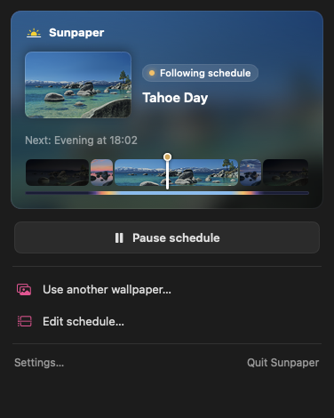
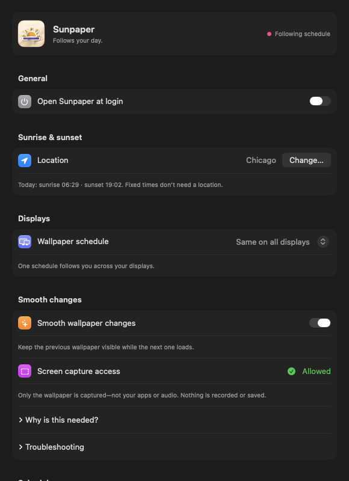

# Sunpaper

Sunpaper is a small macOS menu bar app that keeps Apple’s aerial video
wallpaper in step with the day. Pick matching morning, daytime, evening, and
night aerials; Sunpaper changes between them using sunrise and sunset at your
location.

<p align="center">
  
  &nbsp;&nbsp;
  
</p>

## Download

Download the latest disk image from
**[GitHub Releases](https://github.com/mduncs/sunpaper/releases/latest)**.

1. Open `Sunpaper.dmg`.
2. Drag Sunpaper to Applications.
3. Open Sunpaper. Its sun icon appears in the menu bar.
4. Allow location access, or enter a location manually in Settings.

Before using Sunpaper, open **System Settings → Wallpaper** and download at
least one Apple aerial wallpaper. Sunpaper uses the aerial catalog and video
files already provided by macOS.

> The current 1.1.0 release predates the signed and notarized DMG release
> process. Until a newer notarized release is published, macOS may require
> explicit approval in **System Settings → Privacy & Security**.

## What it does

- Schedules wallpaper changes around local sunrise and sunset
- Supports custom times and any number of time slots
- Includes matching Tahoe and Sequoia aerial sets
- Works across multiple displays
- Can launch automatically when you sign in
- Checks for missing aerial downloads and repairs an out-of-sync wallpaper

## Requirements

- macOS 14 Sonoma or newer
- An Apple aerial wallpaper downloaded through System Settings

Sunpaper is distributed directly rather than through the Mac App Store.
Changing Apple aerial wallpapers requires private macOS wallpaper behavior
that Apple may change in a future system update.

## Troubleshooting

**No aerials appear:** Open System Settings → Wallpaper, select an aerial, and
wait for its download to finish. Then reopen Sunpaper.

**Location was denied:** Open Sunpaper Settings and enter a location manually,
or enable Location Services for Sunpaper in System Settings.

**The wallpaper briefly turns gray:** macOS can show a short gray frame while
its wallpaper process loads a different video.

**Sunpaper will not open:** Use a notarized release when one is available.
For the older unsigned release, select Sunpaper once in Finder, then approve it
under System Settings → Privacy & Security. Only run software from a source you
trust.

## Building from source

Sunpaper is a native SwiftUI app. Xcode 16 or newer is recommended.

```sh
git clone https://github.com/mduncs/sunpaper.git
cd sunpaper
xcodebuild test \
  -project Sunpaper.xcodeproj \
  -scheme Sunpaper \
  -destination 'platform=macOS'
```

To build the app, open `Sunpaper.xcodeproj` in Xcode and run the Sunpaper
scheme. Maintainers can create a signed, notarized release with
`scripts/release.sh`; run `scripts/release.sh --help` for the required
credentials and usage.

## License

[MIT](LICENSE)
